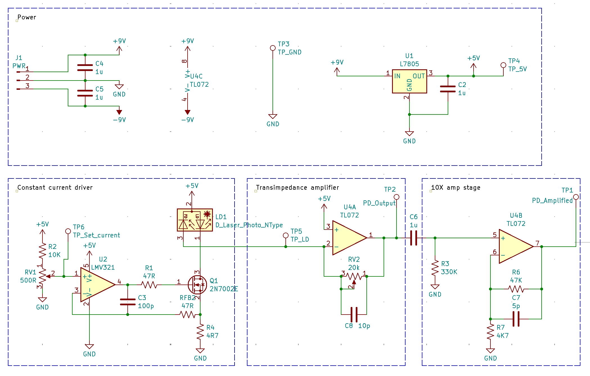
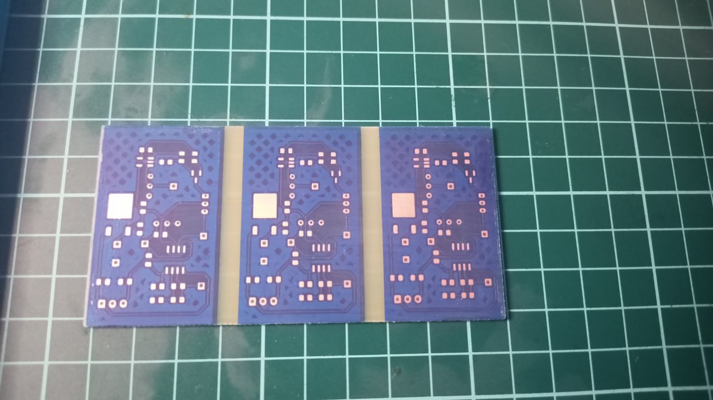
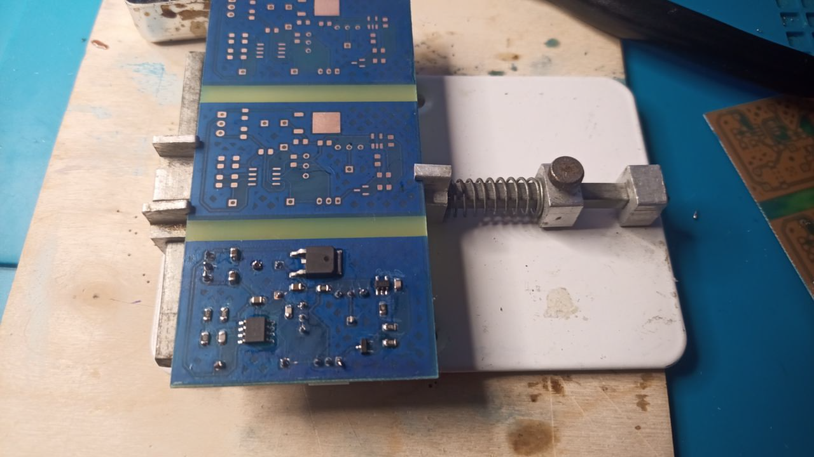
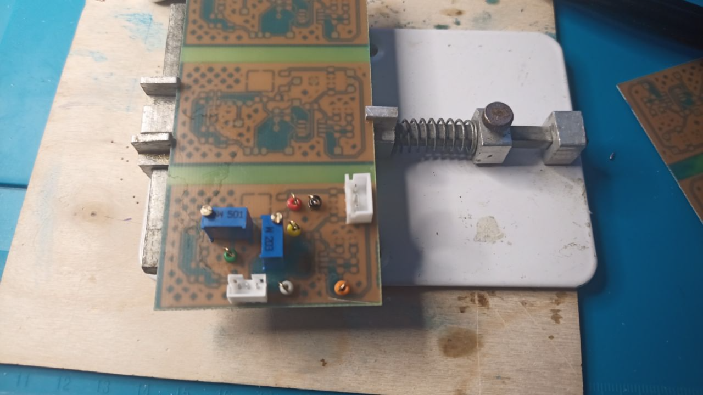
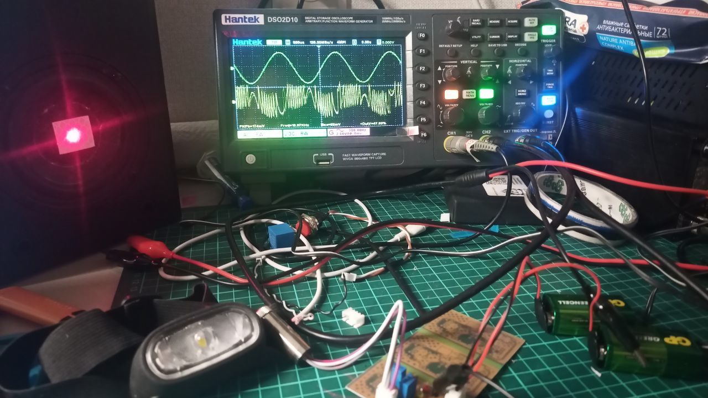
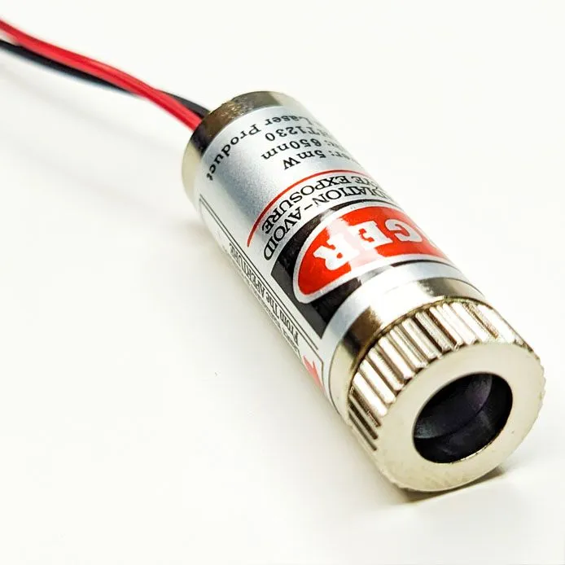
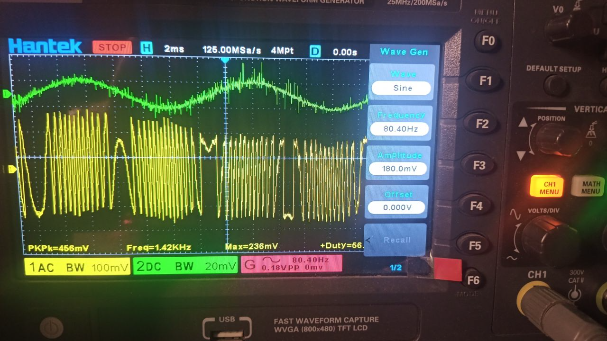

# Драйвер для лазера и усилитель фотодиода для самосмешиваюей интерферометрии(self-mixing interferometry, [SMI](https://en.wikipedia.org/wiki/Self-mixing_interferometry)).

Воспроизведён эксперимент [Laser diode self-mixing: Range-finding and sub-micron vibration measurement](https://www.youtube.com/watch?v=MUdro-6u2Zg)

## Схема драйвера\усилителя

1) Фильтры питания и стабилизатор 5в
2) Регулируемый источник постоянного тока
3) Трансимпедансный усилитель сигнала фотодиода с регулируемым усилением
4) Дополнительная ступень усиления х10

 Схему для KiCad можно посмотреть в соответствующей [папке](./z-selfmixing-laser-interferometer-kicad/)

Номиналы фильтрующих конденсаторов выбраны при помощи ГПСЧ.

## Печатная плата

Плата односторонняя, произведена методом лазерного экспонирования фоторезиста.

Травление -- 1 флакон перекиси водорода, 20г лимонной кислоты, чайная ложка поваренной соли. Для ускорения травления, раствор подогреть в микроволновой печи.

Питание устройства от 2х 9в батареек. Удобный бесшумный источник питания для весьма чувствительного усилителя.

## Установка

  1) Лазер со встроенным фотодиодом контроля мощности. Использован дешёвый лазер с фокусирующей оптикой типа: 
  Электроника управления лазером удалена, пины лазерного диода и фотодиода выведены наружу, через разъём типа JST_PH(3).

  2) Усилитель запитан от 2 элементов типа крона.

  3) Лазер направлен на мембрану динамика с наклеенной световозвращающей лентой. Динамик приводится в действие генератором сигнала, встроенным в осциллограф.

## Результат

На осцилограмме: зелёная линия -- сигнал подаваемый на динамик, жёлтая линия -- осцилограмма интерферометрического сигнала.
